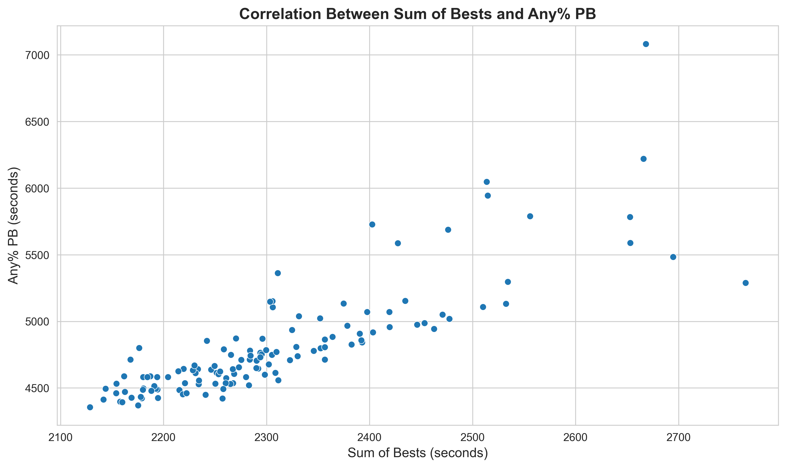
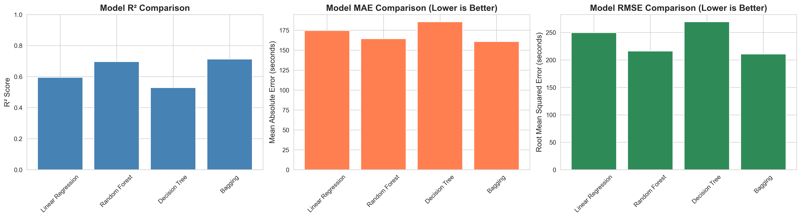
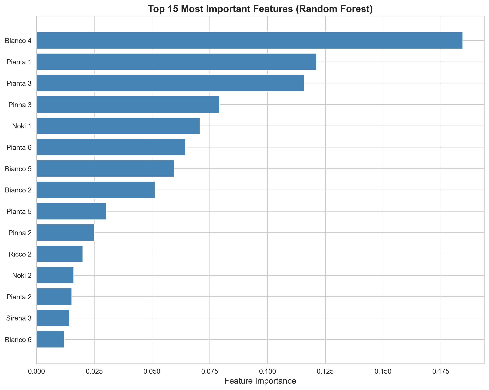

# Super Mario Sunshine Any% Predictor

**Author:** Josh Aresco  
**Course:** Applied Machine Learning  
**Date:** December 2024

---

## Project Overview

This project uses machine learning to predict **Super Mario Sunshine Any% speedrun times** based on Individual Level (IL) performances. By analyzing how runners perform on individual stages, we can accurately predict their full-game completion times.

**Problem Statement:** Can we predict a speedrunner's Any% Personal Best (PB) time using only their individual level times?

**Answer:** Yes! Our Bagging Regressor model achieves **R² = 0.712**, explaining 71% of the variance in Any% times with an average error of just **2.68 minutes**.

---

## Dataset

### Source
The dataset was curated from the Super Mario Sunshine speedrunning community:
1. The community maintains a collaborative spreadsheet tracking Individual Level (IL) times for all runners
2. Source: [Community IL Spreadsheet](https://docs.google.com/spreadsheets/d/1t4Wxie7NXBpEWtsB7prJ5VBkuuP2JmQ5fn_0YlIHRd4/edit?usp=sharing)
3. I filtered the data to include only Any% category times (excluding 100-coin and other categories)
4. I manually collected and added each runner's Any% Personal Best time by hand
5. Final dataset: **130 runners** with **44 features** (individual level times)

### How to Obtain the Dataset
The dataset is stored locally and **not included in this repository**. To reproduce this project:

1. Download the community spreadsheet from the link above
2. Export as `.xlsx` format
3. Place the file in the `data/` directory as `IL_Dataset.xlsx`

Alternatively, contact me for access to the cleaned dataset.

### Target Variable
- **Personal Best (PB):** Full Any% speedrun completion time in seconds

### Features
Individual level times for all 43 levels in the Any% route, including:
- Bianco Hills (2-7)
- Ricco Harbor (1-7)
- Gelato Beach (8,7)
- Pinna Park (1-7, excluding Pinna 1 and Pinna 5)
- Sirena Beach (1-7)
- Noki Bay (1-7)
- Pianta Village (1-7)
- Airstrip
- Corona Mountain

All times were originally in `H:MM:SS.xx` or `M:SS.xx` format and converted to seconds for modeling.

---

## Data Exploration and Cleaning

### Exploratory Data Analysis

The dataset shows a strong positive correlation between the sum of individual level times and Any% PB times:



**Key Findings:**
- Strong positive correlation (r ≈ 0.85+) between Sum of Best times and Any% PB
- Most runners cluster between 4500-5500 seconds (~75-92 minutes) for Any% PB
- Clear linear trend with some variance, suggesting individual skill variations beyond pure level execution

### Data Preprocessing Steps

1. **Time Conversion:** All times converted from `H:MM:SS` or `M:SS` format to seconds
2. **Missing Value Handling:** Missing level times filled with median values
3. **Outlier Removal:** Removed extreme outliers (runners with unrealistic times > 3500 seconds Sum of Bests)
4. **Feature Engineering:** All 43 individual level times used as features
5. **Train/Test Split:** 80/20 split with random_state=42 for reproducibility

**Final Dataset:** 129 runners, 43 features

---

## Model Development

### Methodology

I implemented a **supervised regression pipeline** comparing four models:

1. **Linear Regression** (Baseline)
2. **Decision Tree Regressor**
3. **Random Forest Regressor** (200 estimators)
4. **Bagging Regressor** (100 estimators with Decision Trees)

### Model Justification

**Baseline Model (Linear Regression):**
- Chosen as baseline for its simplicity and interpretability
- Expected to perform reasonably given the linear correlation observed in EDA
- Provides a benchmark for more complex models

**Tree-Based Models:**
- Selected to capture **non-linear relationships** between level times and full-game performance
- Can model interactions between different levels (e.g., momentum from good early-game performance)
- Handle feature importance naturally, revealing which levels matter most

**Ensemble Methods (Random Forest & Bagging):**
- Expected to outperform single trees by reducing overfitting
- Aggregate predictions from multiple models for robustness
- Random Forest adds feature randomization for better generalization

### Training Process

All models were trained on the same 80/20 train/test split using:
```python
python -m trainer.train_pipeline
```

The pipeline:
1. Loads and preprocesses data
2. Trains all four models
3. Evaluates on test set
4. Saves results to `results/model_results.csv`
5. Saves Random Forest feature importances

---

## Model Evaluation

### Performance Comparison



### Results Summary

| Model | R² Score | MAE (minutes) | RMSE (minutes) |
|-------|----------|---------------|----------------|
| **Bagging** | **0.712** | **2.68** | **3.51** |
| Random Forest | 0.697 | 2.74 | 3.60 |
| Linear Regression | 0.595 | 2.91 | 4.16 |
| Decision Tree | 0.529 | 3.09 | 4.49 |

**Winner: Bagging Regressor** 🏆
- Explains **71.2% of variance** in Any% times
- Average prediction error of just **2.68 minutes** (161 seconds)
- Significantly outperforms the simpler baseline models

### Feature Importance Analysis



**Top 5 Most Predictive Levels:**
1. **Bianco 4** - Most important single predictor
2. **Pianta 1** - Second most impactful
3. **Pianta 3** - Third most important
4. **Pinna 3** - Fourth in importance
5. **Noki 1** - Fifth most predictive

**Insights:**
- **Bianco 4 dominates** as the single most predictive level by a significant margin
- **Pianta levels remain highly important** (Pianta 1 and 3 in top 3, Pianta 6 in top 6)
- Mix of early-game (Bianco), mid-game (Pianta, Pinna), and later stages (Noki) all contribute
- Corona Mountain (final level) has relatively low importance, suggesting early-to-mid game performance is more indicative of overall skill

### Why Bianco 4 Matters

[](https://www.youtube.com/watch?v=sEmsC513XXs)

*Click to watch: Bianco 4 (The Red Coins of the Windmill Village) speedrun demonstration*

Bianco 4 is the most technically demanding level in the early game, requiring precise movement, and a masterful understanding of Mario. Its dominance as the #1 predictor suggests that performance on this level is a strong indicator of overall speedrunning skill and execution consistency.

---

## Key Insights

### Model Performance
- **Bagging Regressor is the clear winner**, achieving an R² of 0.712 and explaining 71% of variance in Any% times
- **Ensemble methods** (Bagging and Random Forest) dramatically outperformed simpler models (R² ~0.71 vs 0.53-0.60)
- Linear Regression performed moderately (R² = 0.595), but still struggled with the full complexity of the relationships
- Bagging predictions are accurate within **~2.68 minutes** on average (MAE), making it reliable for performance prediction

### Feature Importance Findings
- **Bianco 4** is the single most predictive level for Any% completion times by a significant margin
- **Pianta levels remain highly important** - Pianta 1, 3, and 6 are all in the top 6 most important predictors
- The top 3 levels (Bianco 4, Pianta 1, Pianta 3) contain significantly more predictive power than other stages
- **Pinna 3 and Noki 1** also emerge as important mid-to-late game indicators
- **Corona Mountain**, the final level, has relatively low importance despite being the last stage - suggesting early-to-mid game performance is more indicative of overall skill

### Implications for Speedrunners
- Speedrunners looking to improve their Any% times should prioritize practice on **Bianco 4 and Pianta levels**
- Performance in early-to-mid game levels (Bianco, Pianta) is a stronger predictor than late-game levels
- The model's high accuracy (R² = 0.71) suggests Individual Level times contain enough signal to reliably predict full-game speedrun capability
- Ensemble methods successfully capture complex interactions between different level performances that linear models miss

---

## How to Run This Project

### Prerequisites
- Python 3.8+
- Required packages (see `requirements.txt`)

### Installation

1. **Clone this repository:**
   ```bash
   git clone https://github.com/JJsrl/SMS-AnyPercent-Predictor.git
   cd SMS-AnyPercent-Predictor
   ```

2. **Install dependencies:**
   ```bash
   pip install -r requirements.txt
   ```

3. **Obtain the dataset:**
   - Download from the [community spreadsheet](https://docs.google.com/spreadsheets/d/1t4Wxie7NXBpEWtsB7prJ5VBkuuP2JmQ5fn_0YlIHRd4/edit?usp=sharing)
   - Save as `data/IL_Dataset.xlsx`

### Running the Pipeline

**Train all models:**
```bash
python -m trainer.train_pipeline
```

This will:
- Load and preprocess the data
- Train all four models (Linear Regression, Random Forest, Decision Tree, Bagging)
- Evaluate on test set
- Save results to `results/model_results.csv`
- Save feature importances to `results/feature_importances.csv`

**Analyze results:**
```bash
jupyter notebook notebooks/results_analysis.ipynb
```

Or open in VS Code and run all cells. This will generate all visualization plots.

---

## Project Structure

```
SMS-AnyPercent-Predictor/
│
├── data/
│   └── IL_Dataset.xlsx          # Dataset (not included - see instructions above)
│
├── models/
│   ├── __init__.py
│   ├── linear_model.py          # Linear Regression model
│   ├── forest_model.py          # Random Forest model
│   ├── tree_model.py            # Decision Tree model
│   └── bagging_model.py         # Bagging model
│
├── trainer/
│   ├── __init__.py
│   ├── data_preprocessing.py    # Data cleaning and preprocessing
│   └── train_pipeline.py        # Main training pipeline
│
├── notebooks/
│   └── results_analysis.ipynb   # Analysis and visualization notebook
│
├── results/
│   ├── model_results.csv        # Saved model performance metrics
│   ├── feature_importances.csv  # Random Forest feature importances
│   ├── eda_correlation.png      # EDA correlation plot
│   ├── model_comparison.png     # Model performance comparison
│   └── feature_importance.png   # Feature importance visualization
│
├── .gitignore
├── README.md
└── requirements.txt             # Python dependencies
```

---

## Technologies Used

- **Python 3.8+**
- **scikit-learn** - Machine learning models and evaluation
- **pandas** - Data manipulation and analysis
- **numpy** - Numerical computing
- **matplotlib** - Data visualization
- **seaborn** - Statistical visualizations
- **openpyxl** - Excel file handling

---

## Author

**Josh Aresco**  
Applied Machine Learning - Final Project  
December 2024

---

## License

This project is for educational purposes as part of a machine learning course.

Dataset credit: Super Mario Sunshine speedrunning community